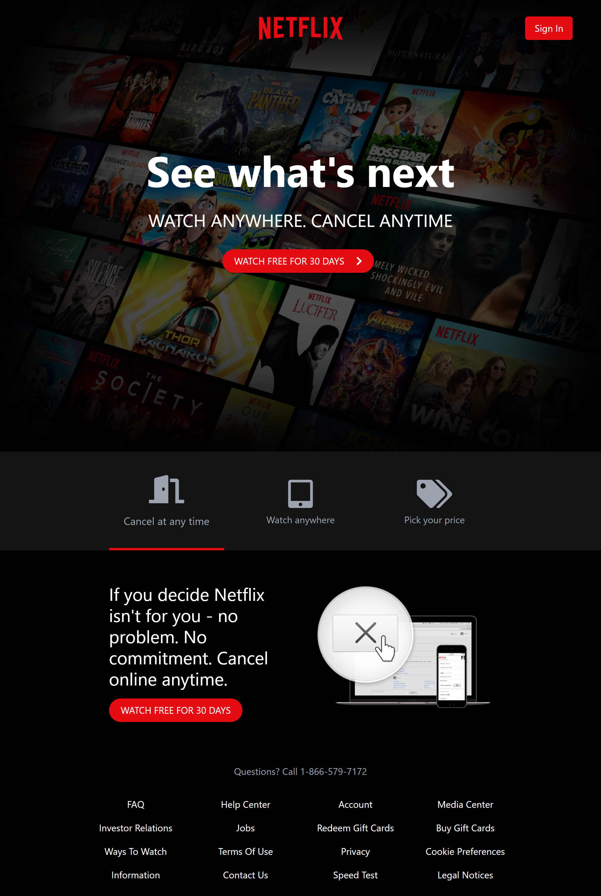

# Netflix Landing Page

This repository contains the code for a Netflix landing page clone. It is built using React, TypeScript, and Tailwind CSS.

## Project Details

- Model: [http://web.archive.org/web/20190101035507/https://www.netflix.com/](http://web.archive.org/web/20190101035507/https://www.netflix.com/)
- Languages:
  - TypeScript: 86.3%
  - CSS: 7.0%
  - HTML: 6.0%
  - JavaScript: 0.7%

## Project Structure

The repository contains the following files and directories:

- `public`: Directory containing public assets and the main HTML file.
- `src`: Directory containing the source code of the Netflix landing page.
- `.gitignore`: Git ignore rules.
- `LICENSE`: License file.
- `README.md`: Readme file (this file).
- `package-lock.json`: NPM package lock file.
- `package.json`: NPM package configuration file.
- `postcss.config.js`: PostCSS configuration file.
- `preview.png`: Preview image.
- `tailwind.config.js`: Tailwind CSS configuration file.
- `tsconfig.json`: TypeScript configuration file.

## Getting Started

To get started with the project, follow these steps:

1. Clone the repository: `git clone <repository-url>`
2. Install dependencies: `npm install`
3. Start the development server: `npm run start`
4. Open the application in your browser: [http://localhost:3000](http://localhost:3000)

## Available Scripts

In the project directory, you can run the following scripts:

- `npm run start`: Starts the development server.
- `npm run build`: Builds the production-ready application.
- `npm run test`: Runs the test suite.
- `npm run eject`: Ejects the project from Create React App.

## Contributing

Contributions to the Netflix Landing Page project are welcome. If you find any issues or want to add new features, please feel free to submit a pull request.

## License

This project is licensed under the Unlicense license. You can find more details in the [LICENSE](LICENSE) file.

Model - > http://web.archive.org/web/20190101035507/https://www.netflix.com/

