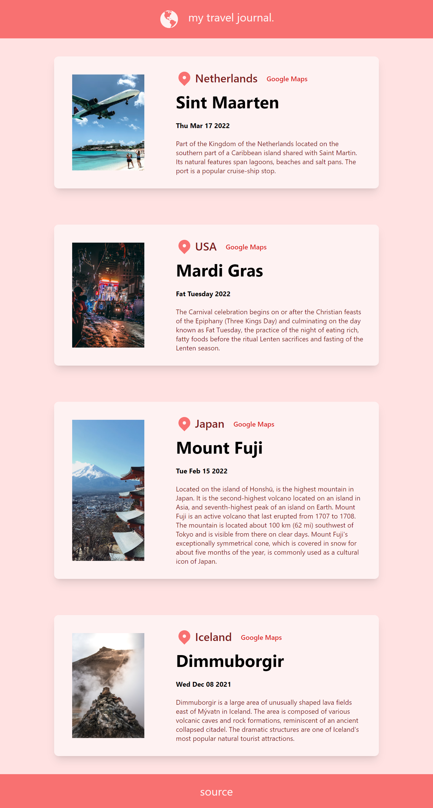

# React Tailwind Travel Journal

This repository contains the code for a travel landing page built using React and Tailwind CSS. It serves as a template for creating a travel journal website.

## Features

- Responsive design
- Stylish and modern landing page layout
- Integration with React Icons for custom icons
- Utilization of React UUID for generating unique IDs
- Customization of styles using Tailwind CSS

## Getting Started

To get started, follow the steps below:

- Install the dependencies:

```
npm install
```

- Run the development server:

```
npm run start
```

- Open the web browser and navigate to http://localhost:3000 to view the travel journal landing page.

## Dependencies

This project uses the following dependencies:

- [Typescript Handbook for React](https://www.typescriptlang.org/docs/handbook/react.html)
- [React Icons GitHub Repository](https://github.com/react-icons/react-icons)
- [React UUID GitHub Repository](https://github.com/RickBr0wn/react-uuid)
- [Tailwind CSS Guides for Create React App](https://tailwindcss.com/docs/guides/create-react-app)

## Preview


